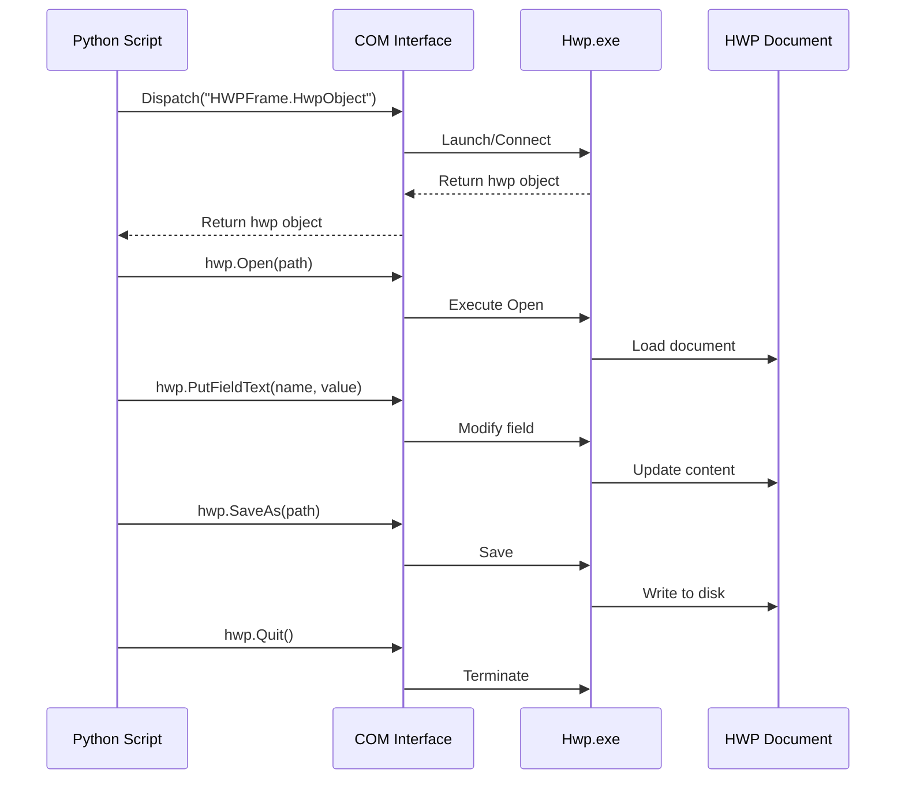
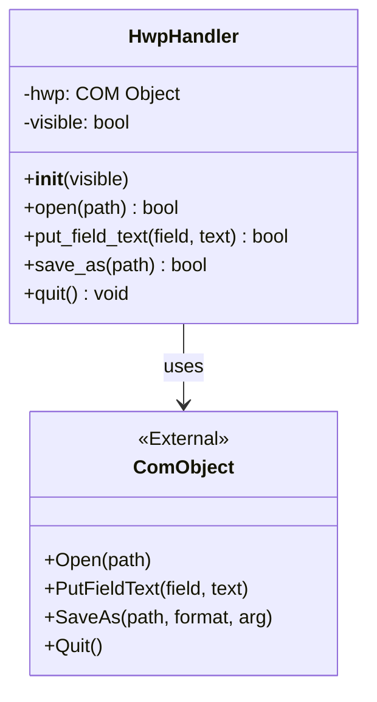

# HWP Automation 개발 가이드

이 문서는 **Windows COM Automation**을 사용하여 한글(HWP) 파일을 Python으로 제어하는 전체 과정을 안내합니다.

---

## 목차
1. [HWP COM Automation 기초 개념](#1-hwp-com-automation-기초-개념)
2. [환경 설정](#2-환경-설정)
3. [HWP API 레퍼런스](#3-hwp-api-레퍼런스)
4. [클래스 설계 가이드](#4-클래스-설계-가이드)
5. [단계별 구현 튜토리얼](#5-단계별-구현-튜토리얼)
6. [트러블슈팅](#6-트러블슈팅)

---

## 1. HWP COM Automation 기초 개념

### 1.1 COM (Component Object Model)이란?
COM은 Windows에서 프로세스 간 통신을 위한 표준 프로토콜입니다. 한글(Hwp)은 **Automation Server**로 동작하며, Python은 **Automation Client**로서 한글을 제어합니다.



### 1.2 핵심 동작 원리
1. **ProgID**: `"HWPFrame.HwpObject"`라는 고유 식별자로 한글 프로그램을 찾습니다.
2. **Dispatch**: COM을 통해 한글 프로그램의 인스턴스를 생성하거나 연결합니다.
3. **Method Call**: Python에서 `hwp.Open()` 같은 메서드를 호출하면, COM이 이를 한글 프로세스로 전달합니다.
4. **Return Value**: 한글이 작업을 수행한 후 결과를 Python으로 반환합니다.

### 1.3 pywin32 라이브러리
Python에서 COM을 사용하려면 `pywin32` 패키지가 필요합니다.

```python
import win32com.client as win32

# EnsureDispatch: 타입 정보를 캐싱하여 성능 향상
hwp = win32.gencache.EnsureDispatch("HWPFrame.HwpObject")

# Dispatch: 단순 연결 (타입 정보 없음, 느림)
# hwp = win32.Dispatch("HWPFrame.HwpObject")
```

> **권장**: `EnsureDispatch`를 사용하면 자동완성과 성능이 향상됩니다.

---

## 2. 환경 설정

### 2.1 필수 요구사항
- **OS**: Windows 7 이상
- **한글**: 한글 2014 이상 (한글과컴퓨터 제품)
- **Python**: 3.7 이상

### 2.2 라이브러리 설치

```powershell
# 가상환경 생성 (선택사항)
python -m venv venv
.\venv\Scripts\Activate.ps1

# pywin32 설치
pip install pywin32
```

### 2.3 설치 검증

```python
import win32com.client as win32

try:
    hwp = win32.gencache.EnsureDispatch("HWPFrame.HwpObject")
    print("✓ HWP COM 연결 성공")
    hwp.Quit()
except Exception as e:
    print(f"✗ 연결 실패: {e}")
```

**예상 결과**: 한글 프로그램이 백그라운드에서 실행되고 바로 종료됩니다.

---

## 3. HWP API 레퍼런스

### 3.1 생명주기 관리

#### `Dispatch(ProgID)`
한글 인스턴스를 생성하거나 기존 인스턴스에 연결합니다.

```python
hwp = win32.gencache.EnsureDispatch("HWPFrame.HwpObject")
```

#### `Quit()`
한글 프로그램을 종료합니다.

```python
hwp.Quit()
```

> [!CAUTION]
> `Quit()`을 호출하지 않으면 `hwp.exe` 프로세스가 백그라운드에 남아 메모리를 소모합니다(좀비 프로세스).

### 3.2 화면 표시 제어

```python
# 표시 (디버깅용)
hwp.XHwpWindows.Item(0).Visible = True

# 숨김 (배포용 - 빠름)
hwp.XHwpWindows.Item(0).Visible = False
```

### 3.3 문서 조작

#### `Open(path)`
HWP 파일을 엽니다.

```python
hwp.Open("C:\\path\\to\\file.hwp")
```

- **Return**: 성공 시 `True`, 실패 시 `False`
- **주의**: 경로는 절대 경로여야 하며, 백슬래시는 이스케이프(`\\`) 필요

#### `Clear(option)`
새 문서를 만들거나 기존 문서를 초기화합니다.

```python
hwp.Clear(1)  # 빈 문서 생성
```

#### `SaveAs(path, format, argument)`
문서를 저장하거나 다른 형식으로 변환합니다.

```python
# HWP로 저장
hwp.SaveAs("C:\\output.hwp", "HWP", "")

# PDF로 변환
hwp.SaveAs("C:\\output.pdf", "PDF", "")
```

**Format 옵션**:
- `"HWP"`: 한글 파일
- `"PDF"`: PDF
- `"HWPX"`: 한글 2014+ (XML 기반)
- `"TEXT"`: 텍스트 파일

### 3.4 누름틀(Field) 조작

#### `PutFieldText(field_name, text)`
지정된 누름틀에 텍스트를 삽입합니다.

```python
success = hwp.PutFieldText("성명", "홍길동")
if success:
    print("텍스트 삽입 성공")
else:
    print("필드를 찾을 수 없음")
```

- **Return**: 성공 시 `True`, 실패 시 `False`
- **주의**: 누름틀 이름은 한글 문서에서 미리 정의되어 있어야 함

#### `GetFieldText(field_name)`
누름틀의 텍스트를 읽어옵니다.

```python
text = hwp.GetFieldText("성명")
print(f"성명: {text}")
```

### 3.5 보안 모듈 등록

```python
hwp.RegisterModule("FilePathCheckDLL", "FilePathCheckerModule")
```

> [!IMPORTANT]
> 이 명령은 파일 접근 시 보안 경고창을 우회하기 위해 필요합니다. 스크립트 시작 시 한 번 호출하세요.

---

## 4. 클래스 설계 가이드

### 4.1 설계 원칙
HWP 제어 로직을 캡슐화하여 재사용성과 유지보수성을 높입니다.

```python
class HwpHandler:
    def __init__(self, visible=False):
        """
        HWP 핸들러 초기화
        
        Args:
            visible (bool): 한글 창을 화면에 표시할지 여부
        """
        self.hwp = None
        self.visible = visible
    
    def open(self, path=None):
        """한글 실행 및 파일 열기"""
        pass
    
    def put_field_text(self, field_name, text):
        """누름틀에 텍스트 삽입"""
        pass
    
    def save_as(self, path):
        """파일 저장"""
        pass
    
    def quit(self):
        """한글 종료"""
        pass
```

### 4.2 클래스 구조



### 4.3 에러 처리 전략

```python
def open(self, path=None):
    try:
        self.hwp = win32.gencache.EnsureDispatch("HWPFrame.HwpObject")
        self.hwp.RegisterModule("FilePathCheckDLL", "FilePathCheckerModule")
        
        if self.visible:
            self.hwp.XHwpWindows.Item(0).Visible = True
        
        if path:
            if not os.path.exists(path):
                raise FileNotFoundError(f"파일을 찾을 수 없습니다: {path}")
            self.hwp.Open(path)
        else:
            self.hwp.Clear(1)
        
        return True
    except Exception as e:
        print(f"오류 발생: {e}")
        return False
```

---

## 5. 단계별 구현 튜토리얼

### Step 1: 기본 연결 테스트
**목표**: Python과 한글이 정상적으로 연결되는지 확인

```python
# test_connection.py
import win32com.client as win32

hwp = win32.gencache.EnsureDispatch("HWPFrame.HwpObject")
hwp.XHwpWindows.Item(0).Visible = True  # 화면에 표시
print("한글이 실행되었습니다. 5초 후 종료합니다.")

import time
time.sleep(5)
hwp.Quit()
```

**실행**: `python test_connection.py`

**예상 결과**: 한글 빈 문서가 5초간 표시된 후 자동으로 종료됩니다.

---

### Step 2: 파일 열기 및 저장
**목표**: 기존 파일을 열고 다른 이름으로 저장

```python
# test_file_io.py
import win32com.client as win32
import os

hwp = win32.gencache.EnsureDispatch("HWPFrame.HwpObject")
hwp.RegisterModule("FilePathCheckDLL", "FilePathCheckerModule")

# 파일 경로 (절대 경로로 수정 필요)
input_file = r"C:\WorkSpace\poc-hwp-automation\sample.hwp"
output_file = r"C:\WorkSpace\poc-hwp-automation\output.hwp"

# 파일 열기
if os.path.exists(input_file):
    hwp.Open(input_file)
    print(f"파일 열기 성공: {input_file}")
else:
    print("파일이 없으므로 새 문서 생성")
    hwp.Clear(1)

# 저장
hwp.SaveAs(output_file, "HWP", "")
print(f"저장 완료: {output_file}")

hwp.Quit()
```

**실행 전 준비**:
1. `sample.hwp` 파일을 만들어 프로젝트 폴더에 넣거나
2. 코드를 수정하여 새 문서 생성 경로로 진행

---

### Step 3: 누름틀 다루기
**목표**: 누름틀에 데이터 삽입

#### 3-1. 한글에서 누름틀 만들기
1. 한글 실행
2. 텍스트 입력: `성명: [여기에 누름틀]`
3. 커서를 텍스트 뒤에 위치
4. 메뉴: `입력 > 누름틀 > 누름틀 만들기` (또는 `Ctrl+N, K`)
5. "누름틀 이름"에 `성명` 입력 → 확인
6. 파일 저장: `template.hwp`

#### 3-2. Python으로 누름틀에 값 넣기

```python
# test_field.py
import win32com.client as win32

hwp = win32.gencache.EnsureDispatch("HWPFrame.HwpObject")
hwp.RegisterModule("FilePathCheckDLL", "FilePathCheckerModule")
hwp.XHwpWindows.Item(0).Visible = True

# 템플릿 열기
hwp.Open(r"C:\WorkSpace\poc-hwp-automation\template.hwp")

# 누름틀에 값 삽입
if hwp.PutFieldText("성명", "홍길동"):
    print("성공: 성명 필드 입력됨")
else:
    print("실패: 성명 필드를 찾을 수 없음")

# 결과 저장
hwp.SaveAs(r"C:\WorkSpace\poc-hwp-automation\filled.hwp", "HWP", "")
print("작업 완료. 5초 후 종료...")

import time
time.sleep(5)
hwp.Quit()
```

**확인**: `filled.hwp` 파일을 열어서 "성명" 자리에 "홍길동"이 들어갔는지 확인

---

### Step 4: HwpHandler 클래스 구현
**목표**: 재사용 가능한 클래스로 리팩토링

```python
# hwp_handler.py
import win32com.client as win32
import os

class HwpHandler:
    def __init__(self, visible=False):
        self.hwp = None
        self.visible = visible
    
    def open(self, path=None):
        """한글 실행 및 파일 열기"""
        try:
            self.hwp = win32.gencache.EnsureDispatch("HWPFrame.HwpObject")
            self.hwp.RegisterModule("FilePathCheckDLL", "FilePathCheckerModule")
            
            self.hwp.XHwpWindows.Item(0).Visible = self.visible
            
            if path:
                if not os.path.exists(path):
                    raise FileNotFoundError(f"파일을 찾을 수 없습니다: {path}")
                self.hwp.Open(path)
            else:
                self.hwp.Clear(1)
            
            return True
        except Exception as e:
            print(f"오류: {e}")
            return False
    
    def put_field_text(self, field_name, text):
        """누름틀에 텍스트 삽입"""
        if not self.hwp:
            print("한글이 실행되지 않았습니다.")
            return False
        return self.hwp.PutFieldText(field_name, text)
    
    def save_as(self, path):
        """파일 저장"""
        if not self.hwp:
            return False
        
        fmt = "HWP"
        if path.lower().endswith(".pdf"):
            fmt = "PDF"
        elif path.lower().endswith(".hwpx"):
            fmt = "HWPX"
        
        return self.hwp.SaveAs(path, fmt, "")
    
    def quit(self):
        """한글 종료"""
        if self.hwp:
            self.hwp.Quit()
            self.hwp = None
```

---

### Step 5: PoC 실행 스크립트 작성
**목표**: 전체 워크플로우 자동화

```python
# run_poc.py
import os
from hwp_handler import HwpHandler

def main():
    base_dir = os.path.dirname(os.path.abspath(__file__))
    template_file = os.path.join(base_dir, "template.hwp")
    output_file = os.path.join(base_dir, "result_application.hwp")
    
    # 1. HwpHandler 인스턴스 생성
    hwp = HwpHandler(visible=True)  # 디버깅용으로 화면 표시
    
    try:
        # 2. 템플릿 파일 열기
        print(f"템플릿 열기: {template_file}")
        if not hwp.open(template_file):
            print("템플릿을 열 수 없습니다.")
            return
        
        # 3. 데이터 주입
        data = {
            "성명": "홍길동",
            "생년월일": "1995년 5월 5일",
            "주소": "서울시 강남구 테헤란로 123",
            "연락처": "010-1234-5678"
        }
        
        print("데이터 삽입 중...")
        for field, value in data.items():
            if hwp.put_field_text(field, value):
                print(f"  ✓ {field}: {value}")
            else:
                print(f"  ✗ {field}: 필드를 찾을 수 없음")
        
        # 4. 결과 저장
        print(f"저장 중: {output_file}")
        if hwp.save_as(output_file):
            print("저장 성공!")
        else:
            print("저장 실패")
        
    except Exception as e:
        print(f"에러 발생: {e}")
    finally:
        # 5. 종료
        import time
        time.sleep(2)  # 결과 확인을 위해 잠시 대기
        hwp.quit()
        print("완료")

if __name__ == "__main__":
    main()
```

**실행**:
```powershell
python run_poc.py
```

---

## 6. 트러블슈팅

### 문제 1: `pywintypes.com_error: (-2147221005, '클래스가 등록되지 않았습니다', None, None)`

**원인**: 한글 프로그램이 설치되지 않았거나, COM 등록이 안 됨

**해결**:
1. 한글 프로그램 설치 확인
2. 관리자 권한으로 한글 실행 → 한 번 실행 후 종료
3. 레지스트리에 COM 등록 확인:
   ```powershell
   reg query HKEY_CLASSES_ROOT\HWPFrame.HwpObject
   ```

---

### 문제 2: 보안 경고창이 계속 뜸

**원인**: 파일 접근 권한 확인 모듈 미등록

**해결**:
```python
hwp.RegisterModule("FilePathCheckDLL", "FilePathCheckerModule")
```
→ 이 코드를 `Dispatch` 직후에 반드시 호출

또는, 한글 설정에서:
- `도구 > 환경 설정 > 기타 > 문서 보안` → "매크로 보안 수준" 낮춤 (권장하지 않음)

---

### 문제 3: `hwp.exe` 프로세스가 계속 남아있음

**원인**: `Quit()` 미호출 또는 예외 발생 시 종료 누락

**해결**:
```python
try:
    # ... 작업 ...
finally:
    if hwp:
        hwp.quit()
```

**수동 종료**:
```powershell
taskkill /F /IM hwp.exe
```

---

### 문제 4: 누름틀 이름을 정확히 입력했는데 `PutFieldText`가 False 반환

**원인**: 
1. 누름틀 이름 오타 (대소문자, 공백 등)
2. 누름틀이 제대로 만들어지지 않음

**해결**:
1. 한글에서 누름틀 재확인: `Ctrl+N, M` (누름틀 편집 모드)
2. 누름틀 이름을 정확히 복사

---

### 문제 5: PDF 변환 시 빈 파일 생성

**원인**: PDF 변환 옵션 미지정

**해결**:
```python
hwp.SaveAs("output.pdf", "PDF", "")
```
→ 세 번째 인자를 빈 문자열(`""`)로 설정

---

## 부록: 프로젝트 구조 예시

```
poc-hwp-automation/
├── requirements.txt          # pywin32==306
├── hwp_handler.py            # HwpHandler 클래스
├── run_poc.py                # PoC 실행 스크립트
├── template.hwp              # 누름틀이 포함된 샘플 서식
├── sample.hwp                # 테스트용 HWP 파일
└── output/                   # 결과 파일 저장 디렉토리
    ├── filled.hwp
    └── result_application.hwp
```

---

## 참고 자료
- [한글 자동화 API 공식 문서](http://www.hancom.com/) (한컴오피스 개발자 센터)
- [pywin32 공식 문서](https://github.com/mhammond/pywin32)
- COM 기초: Microsoft MSDN COM 가이드

---

